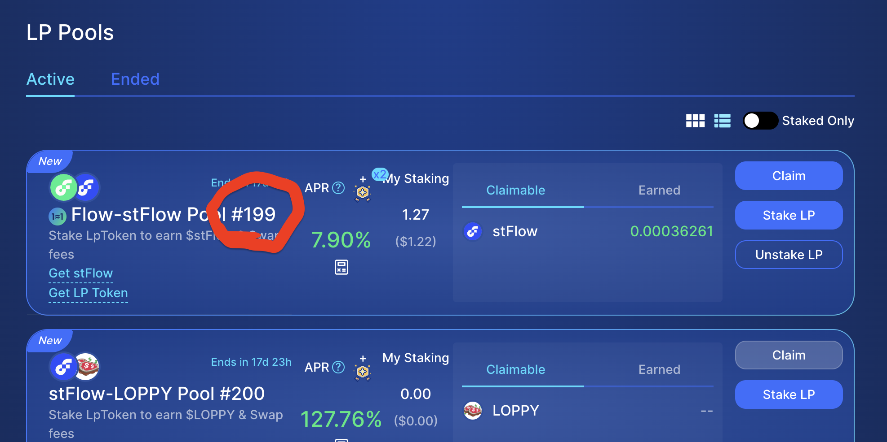

## 👋 Welcome to the DeFiActions Scaffold

This repository is a scaffold for building with Flow Actions (DeFiActions) and includes AI-friendly guidance for composing safe Cadence transactions from standardized connectors.

- **What’s included**:
  - Minimal Flow project with dependencies for DeFiActions and IncrementFi connectors
  - Example transaction: Claim → Zap → Restake for IncrementFi LP rewards
  - Cursor rules context for DeFiActions; helpful for agent-assisted development ([Cursor Rules](https://docs.cursor.com/en/context/rules))

References:
- FLIP-338: Flow Actions – composable standards for protocols ([FLIP PR #339](https://github.com/onflow/flips/pull/339))
- DeFiActions repo: [onflow/DeFiActions](https://github.com/onflow/DeFiActions)

## 🚀 Quick Start: Mainnet

- **Warning**: Transactions on mainnet incur fees and affect on-chain balances. Proceed carefully. For safety, consider creating a new Flow Wallet account with limited funds when exporting a private key.
- **1) Clone and install deps**:
  ```bash
  git clone <REPO_URL>
  cd defiactions-scaffold
  flow deps install
  ```
- **2) Create or configure your signer**:
  - Use an existing account: export your private key from the Flow Wallet Extension and configure it as your signer. Docs: [Flow Wallet Extension — Export private key](https://docs.wallet.flow.com/tutorial/extension-private-key-and-seed-phrase-guide)
  - Or create a new mainnet account:
    ```bash
    flow accounts create --network mainnet
    ```
    Docs: [Flow CLI Accounts](https://developers.flow.com/tools/flow-cli/accounts)
  - Then add the signer to `flow.json` with your address and key file (or configure env-based signing). Ensure the account has sufficient FLOW for fees and storage.
- **3) Stake 5 FLOW on IncrementFi**: Go to `https://app.increment.fi` and stake 5 FLOW so you have an active position.
- **4) Create your staking certificate (if needed)**: Initialize `Staking.UserCertificate` using the Flow Script Runner (Mainnet): https://run.dnz.dev/snippet/d1bf715483551879
- **5) Find your pool id**: Open the IncrementFi Farms page: https://app.increment.fi/farm and use the number in the pool name (e.g., `#198`). That number is your `pid`.
- **6) Send the transaction on mainnet** (replace `<POOL_PID>` and signer):
  ```bash
  flow transactions send cadence/transactions/increment_fi_restake.cdc \
    --network mainnet \
    --signer mainnet-account \
    --args-json '[{"type":"UInt64","value":"<POOL_PID>"}]'
  ```

## 🔨 Prerequisites

- Flow CLI: install from the [Flow CLI docs](https://developers.flow.com/tools/flow-cli/install)
- Cursor + Cadence extension (recommended): [Cadence Extension](https://marketplace.visualstudio.com/items?itemName=onflow.cadence)

## 📦 Project Structure

```
defiactions-scaffold/
├── flow.json                              # Project configuration with DeFiActions/IncrementFi dependencies
├── README.md                              # This file
└── cadence/
    ├── contracts/                         # 🔌 Connector Contracts
    │   └── ExampleConnectors.cdc          # Example TokenSink connector implementation
    ├── scripts/                           # 📖 Read-Only Scripts
    │   └── get_available_rewards.cdc      # Query claimable rewards from IncrementFi pools
    ├── transactions/                      # 💸 Transaction Templates
    │   └── increment_fi_restake.cdc       # Claim + Zap + Restake IncrementFi rewards
    └── tests/                             # 🧪 Test Files
        └── (test files as needed)
```

### 🔌 **Available Connectors**
- **`ExampleConnectors.TokenSink`** - Simple sink that deposits tokens into a vault capability
  - Demonstrates DeFiActions.Sink interface implementation
  - Type-safe deposits with precondition checks
  - UniqueIdentifier support for operation tracing

### 📖 **Available Scripts**
- **`get_available_rewards.cdc`** - Query claimable rewards from IncrementFi staking pools
  - **Inputs**: `staker: Address, pid: UInt64`
  - **Output**: `UFix64` - Amount of rewards available to claim
  - Uses `PoolRewardsSource.minimumAvailable()` for accurate reward calculation

### 💸 **Available Transactions**
- **`increment_fi_restake.cdc`** - Complete restaking workflow for IncrementFi pools
  - **Input**: `pid: UInt64` - Pool ID to restake rewards for
  - **Flow**: Claim rewards → Zap to LP tokens → Restake into same pool
  - **Safety**: Pre/post conditions, residual assertions, capacity-based withdrawals
  - **Components**: Uses `PoolRewardsSource`, `Zapper`, `SwapSource`, and `PoolSink`

## ⚙️ Setup

You can run locally on the emulator or target testnet/mainnet. String-based imports resolve when the target network is running and dependencies are deployed or aliased in `flow.json`.

### 1. Install Cadence dependencies (required)

Install all declared dependencies from `flow.json` right after cloning locally:
```bash
flow deps install
```
See the Flow CLI Dependency Manager docs for details: [Dependency Manager](https://developers.flow.com/tools/flow-cli/dependency-manager).

### 2. Choose your deployment option

#### Option A: Emulator (local)

1. Start the emulator (terminal A):
   ```bash
   flow emulator
   ```

2. Deploy configured contracts (terminal B):
   ```bash
   flow project deploy --network emulator
   ```

**Notes:**
- This deploys the dependencies listed under `deployments.emulator` in `flow.json` to the local dev account
- Some protocol state (pairs/pools) may not exist on emulator by default; transactions that depend on live IncrementFi state may require custom local bootstrap

##### Create `emulator-account.pkey` (required)
If your `flow.json` references a key file for the `emulator-account`, create one and run the emulator with that same key so signing matches the service account. This is required; starting the emulator without the same private key will cause deploys/signing to fail.

1) Generate a key pair and copy the private key hex
```bash
flow keys generate --sig-algo ECDSA_P256 --hash-algo SHA3_256
# Copy the "Private Key" value from the output (hex string)
```

2) Save the private key to `emulator-account.pkey` in the project root
```bash
printf "<PASTE_PRIVATE_KEY_HEX_HERE>" > emulator-account.pkey
```

3) Start the emulator using the same key and algos
```bash
flow emulator \
  --service-priv-key $(cat emulator-account.pkey) \
  --service-sig-algo ECDSA_P256 \
  --service-hash-algo SHA3_256 \
  --service-addr f8d6e0586b0a20c7
```

4) Deploy contracts (in a separate terminal)
```bash
flow project deploy --network emulator
```

#### Option B: Testnet (recommended for live protocol state)

1. Create or configure a testnet account in `flow.json`:
```bash
flow accounts create --network testnet
```

2. Ensure dependencies in `flow.json` include `testnet` aliases (this scaffold includes many prefilled)

3. No local deploy is required - contracts already exist on testnet and imports use the configured addresses

## 🔧 Deploying connectors

- **Emulator (local)**: Contracts listed under `deployments.emulator` in `flow.json` (e.g., `DeFiActions`, `IncrementFiStakingConnectors`, `IncrementFiPoolLiquidityConnectors`, `SwapConnectors`, `Staking`, etc.) are deployed to your local dev account when you run:
```bash
flow project deploy --network emulator
```
If you restart the emulator, redeploy.

- **Testnet/Mainnet**: Connectors are already deployed and referenced via `dependencies.aliases` in `flow.json`. You usually do not deploy them yourself. If you maintain custom forks, update `flow.json` aliases and deploy with your signer.

### 3. Prepare your account

#### For Emulator (local development)
- Use the built-in `emulator-account` (pre-funded). No action needed.

#### For Testnet
1. Create an account:
```bash
flow accounts create --network testnet
```

2. Add a signer alias in `flow.json` under `accounts` with its address and key file:
```json
{
  "accounts": {
    "testnet-account": {
      "address": "<YOUR_TESTNET_ADDRESS>",
      "key": { "type": "file", "location": "testnet-account.pkey" }
    }
  }
}
```

3. Fund it via the Testnet Faucet: [testnet-faucet.onflow.org](https://testnet-faucet.onflow.org)

4. Quick link (Testnet): Create your `Staking.UserCertificate` using this Flow Script Runner: https://run.dnz.dev/snippet/12d94bff356ed607

#### For Mainnet
1. Add your mainnet account to `flow.json` under `accounts` (address + key file or env)
- Docs: [Flow CLI Accounts](https://developers.flow.com/tools/flow-cli/accounts) | [Keys](https://developers.flow.com/tools/flow-cli/keys)

2. Ensure sufficient FLOW for fees and storage
- See [Fees](https://developers.flow.com/build/basics/fees) and your wallet provider

Protocol requirement:
- Ensure the signer has `Staking.UserCertificate` at `Staking.UserCertificateStoragePath`. If already staking in the target IncrementFi pool, you likely have one; otherwise follow the IncrementFi staking docs to initialize it.
- Quick link (Mainnet): Create your `Staking.UserCertificate` using this Flow Script Runner: https://run.dnz.dev/snippet/d1bf715483551879

### 🔎 Find your Pool ID (Mainnet)
- Go to the IncrementFi Farms page: https://app.increment.fi/farm
- Locate your pool and read the number in the pool name (formatted like `#198`). That number is the `pid` used by scripts and transactions.



## ▶️ Run the IncrementFi Restake Transaction

Transaction: `cadence/transactions/increment_fi_restake.cdc`

Purpose:
- Claim pending farm rewards → Zap to LP → Stake LP back to the same pool

Parameters:
- `pid: UInt64` – IncrementFi pool ID

Mainnet example (replace `mainnet-account` with your signer alias):
```bash
flow transactions send cadence/transactions/IncrementFi_Restake.cdc \
  --network mainnet \
  --signer mainnet-account \
  --args-json '[{"type":"UInt64","value":"<POOL_PID>"}]'
```

Testnet example (replace `testnet-account` with your signer alias):
```bash
flow transactions send cadence/transactions/increment_fi_restake.cdc \
  --network testnet \
  --signer testnet-account \
  --args-json '[{"type":"UInt64","value":"<POOL_PID>"}]'
```

Emulator example (after deploy):
```bash
flow transactions send cadence/transactions/increment_fi_restake.cdc \
  --network emulator \
  --signer emulator-account \
  --args-json '[{"type":"UInt64","value":"0"}]'
```

Requirements:
- Signer must have `Staking.UserCertificate` at `Staking.UserCertificateStoragePath`.
- `pid` must be a valid pool with rewards and a corresponding pair.
- Ensure `flow deps install` has been run after cloning so string-based imports resolve via `flow.json` aliases.
- On mainnet, ensure your signer has sufficient FLOW for tx and storage; verify connector addresses match `flow.json` dependencies.

## 🧭 DeFiActions Composition (quick reference)

Minimal restake flow connectors used in `cadence/transactions/increment_fi_restake.cdc`: 
- Source: `IncrementFiStakingConnectors.PoolRewardsSource`
- Swapper: `IncrementFiPoolLiquidityConnectors.Zapper` (token types and `stableMode` from pair)
- SwapSource: `SwapConnectors.SwapSource(swapper, source)`
- Sink: `IncrementFiStakingConnectors.PoolSink`

String-based imports are used throughout (see file for full example). Safety invariants: size withdraws by sink capacity, assert residuals, single-expression pre/post.

## 💬 Example AI prompts
- "Create me a Cadence transaction which restakes my Increment Fi LP token staking rewards"
- "Generate a minimal restake transaction using DeFiActions connectors (PoolRewardsSource → Zapper via SwapSource → PoolSink) with string imports and safety invariants"
- "Compose a SwapSource from PoolRewardsSource and IncrementFiPoolLiquidityConnectors.Zapper, then stake to IncrementFiStakingConnectors.PoolSink with pre/post checks and residual assertion"
- "Add a post condition verifying the stake increased by the expected zapper.quoteOut amount"

## 🧪 Testing

Run Cadence tests:
```bash
flow test
```

Lint a transaction:
```bash
flow cadence lint cadence/transactions/increment_fi_restake.cdc --network emulator
```

Note on checks: static checks that resolve imports require the target network to be up and/or contracts deployed. Prefer running against `--network testnet` for live protocol state.

## 🔗 Helpful Links

- Flow Docs: [developers.flow.com](https://developers.flow.com)
- Cadence Language: [cadence-lang.org/docs/language](https://cadence-lang.org/docs/language)
- Block Explorers: [Flowscan](https://flowscan.io/)

## 🤝 Community
- Forum: [forum.flow.com](https://forum.flow.com/)
- Discord: [discord.gg/flow](https://discord.gg/flow)
- Telegram: [Flow Blockchain - Official](https://t.me/flow_blockchain)
- X: [@flow_blockchain](https://x.com/flow_blockchain)
